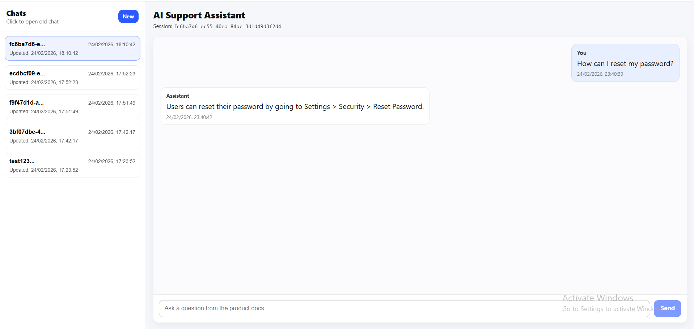
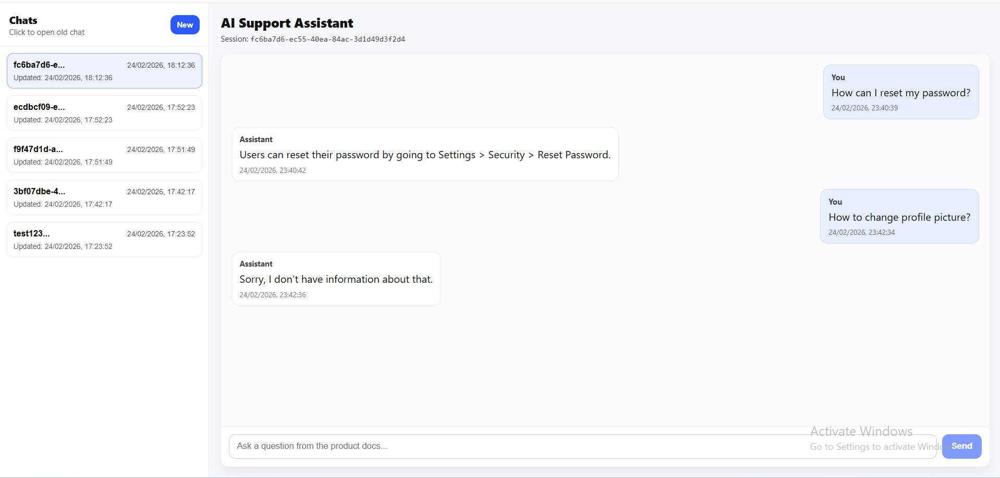
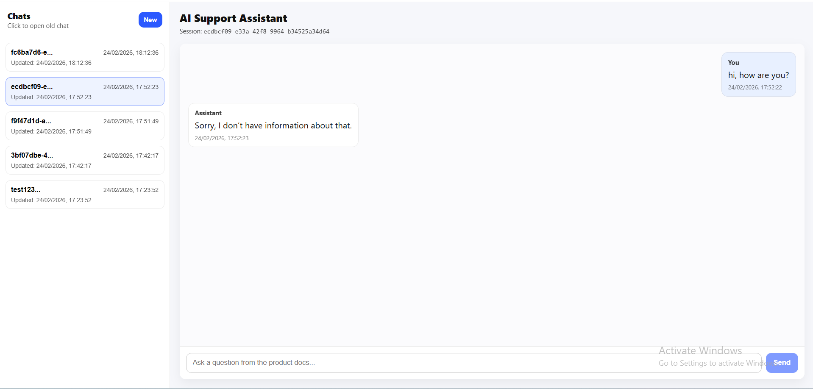

# AI-Powered Support Assistant (React + Node + SQLite + LLM)

A full-stack AI support assistant that answers user questions strictly from provided product documentation (`docs.json`), maintains session-wise context, and stores all conversations in SQLite.

If the answer is not present in the docs, it responds:
> "Sorry, I don’t have information about that."

---

## Tech Stack

- Frontend: React (Vite)
- Backend: Node.js (Express)
- Database: SQLite (better-sqlite3)
- LLM: OpenAI (configurable)

---

## Project Structure

ai-support-assistant/
docs.json
.env.example
backend/
frontend/

---

## setup

1) Configure docs
Edit `docs.json` (project root). Example entry:

json
{
  "title": "Reset Password",
  "content": "Users can reset their password by going to Settings > Security > Reset Password."
}

2) Backend setup
cd backend
npm install

Create backend/.env:

PORT=8080
CORS_ORIGIN=http://localhost:5173
OPENAI_API_KEY=YOUR_OPENAI_KEY
OPENAI_MODEL=gpt-4.1-mini

Run backend:

npm run dev

Health check:

GET http://localhost:8080/health → { "ok": true }

3) Frontend setup
cd ../frontend
npm install
npm run dev

Open:

http://localhost:5173

## API Documentation
1) POST /api/chat

Request:

{
  "sessionId": "abc123",
  "message": "How can I reset my password?"
}

Response:

{
  "reply": "Users can reset their password by going to Settings > Security > Reset Password.",
  "tokensUsed": 123
}

If not found in docs:

{
  "reply": "Sorry, I don’t have information about that.",
  "tokensUsed": 0
}
2) GET /api/conversations/:sessionId

Returns all messages for the session in chronological order.

Response:

{
  "sessionId": "abc123",
  "messages": [
    { "id": 1, "role": "user", "content": "...", "createdAt": "..." },
    { "id": 2, "role": "assistant", "content": "...", "createdAt": "..." }
  ]
}
3) GET /api/sessions

Returns list of sessions with last updated timestamp.

Response:

{
  "sessions": [
    {
      "sessionId": "abc123",
      "createdAt": "2026-02-24 17:20:00",
      "lastUpdated": "2026-02-24 17:25:00"
    }
  ]
}

## Database Schema (SQLite)
sessions
column	type
id	TEXT (PK)
created_at	DATETIME
updated_at	DATETIME
messages
column	type
id	INTEGER (PK autoinc)
session_id	TEXT (FK to sessions.id)
role	TEXT ("user"/"assistant")
content	TEXT
created_at	DATETIME
Document-Only Answering (Strict)

The assistant is required to answer only using docs.json.

Implementation details:

Backend selects relevant docs (top 3) using a simple keyword overlap score.

Backend sends relevant docs + last 5 user/assistant pairs from SQLite as context.

Prompt forces the model to output SOURCE: <Doc Title> on the last line.

Backend validates the SOURCE must match one of the provided doc titles.

If validation fails → fallback response is returned.

Rate Limiting

Basic IP-based rate limiting is enabled:

30 requests per minute per IP (configurable)

## Assumptions

Sessions are created on first /api/chat call.

The frontend stores the active sessionId in localStorage.

The sidebar lists all previous sessions (extra UI improvement).

Docs are maintained in docs.json and can be edited anytime.

## Screenshots

### Chat Working

### Fallback Behavior

### Session Switching

